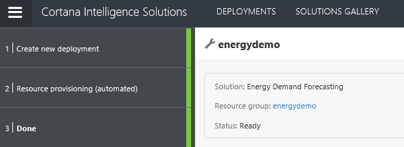
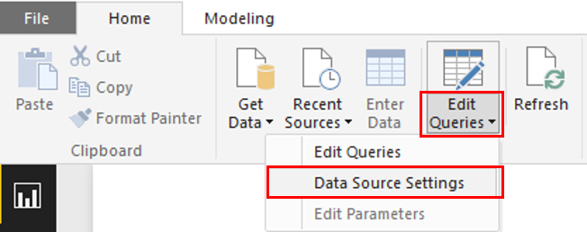

# [Energy Demand Forecast Solution](https://go.microsoft.com/fwlink/?linkid=831187)

# Post Deployment Instructions
Once the solution is deployed to the subscription, you can see the services deployed by clicking the resource group name on the final deployment screen in the CIS.

This will show all the resources under this resource groups on [Azure management portal](https://portal.azure.com/).

After successful deployment, the entire solution is automatically started on cloud. You can monitor the progress from the following resources.

## **Monitor progress**

#### Web Jobs
6 Azure Web jobs are created during the deployment. You can monitor the web jobs by clicking the link on your deployment page.
* One-time running web jobs are used to start certain Azure services.
  * PastData: Copies the historical consumption and weather sample data to Azure SQL.
  * GalleryToMLSvc: Creates demand forecast ML experiment and publish it as ML WebService.
  * StartPipelines: Starts the Azure Data Factory pipelines.
* Continuous running web jobs are used as data generator.
  * FiveMinsDataToEH: Simulates energy consumption data and sends it to Event Hub every 5 minutes.
  * FiveMinsDataToSQL: Simulates energy consumption data and sends it to Azure SQL every 5 minutes.
  * WeatherHourlyDataToSQL: Simulates weather data and sends it to Azure SQL every hour.

#### Azure Data Factory

Azure Data Factory is used to schedule machine learning model. You can monitor the data pipelines by clicking the link on your deployment page.

*Note: The Web Jobs need time to finish the first run. It is normal to see errors in your Azure Data Factory pipelines right after you deployed the solution.*

#### Azure SQL Database

Azure SQL database is used to save the data and forecast results. You can use the credentials showing on your deployment screen to log in your database and check the results.

#### Azure Machine Learning Web Service

You can view your forecasting model on machine learning experiment by navigating to your Machine Learning Workspace. The machine learning model is deployed as Azure Web Service to be scheduled every hour for retraining by the Azure Data Factory. You can view your the web service API manual by clicking the link on your deployment page.

## **Visualize in Power BI Dashboard**

Power BI dashboard can be used to visualize the real-time energy consumption data as well as the updated energy forecast results. The following instructions will guide you to build a dashboard to visualize data from database and from real-time data stream.

### Visualize Energy Data from Database

The essential goal of this part is to get the demand forecast of each region and visualize it. Power BI can directly connect to an Azure SQL database as its data source, where the prediction results are stored.

> Note:  1) In this step, the prerequisite is to download and install the free software [Power BI desktop](https://powerbi.microsoft.com/desktop). 2) We recommend you start this process 2-3 hours after you deploy the solution so that you have more data points to visualize.

1.  Get the database credentials.

    You can find your database credentials on the page when you finish your deployment.

2.	Update the data source of the Power BI file
	-  Make sure you have installed the latest version of [Power BI desktop](https://powerbi.microsoft.com/desktop).

	-	In this Git repository, you can download the **'EnergyDemandForecastSolution.pbix'** file under the folder **'Power BI'** and then open it. **Note:** If you see an error massage, please make sure you have installed the latest version of Power BI Desktop.

  - On the top of the file, click **‘Edit Queries’** drop down menu. Then choose **'Data Source Settings'**.
  

	- In the pop out window, click **'Change Source'**, then replace the **"Server"** and **"Database"** with	your own server and database names and click **"OK"**. For server
	name, make sure you specify the port 1433 in the end of your server string
	(**YourSolutionName.database.windows.net, 1433**). After you finish editing, close the 'Data Source Settings' window.

	- On the top of the screen, you will see a message. Click **'Apply Changes'** and now the dashboard is updated to connect to your database. In the backend, model is scheduled to be refreshed every 1 hour. You can click **'Refresh'** button on the top to get the latest visualization as time moving forward.

3. (Optional) Publish the dashboard to [Power BI
    online](http://www.powerbi.com/). Note that this step needs a Power BI account (or Office 365 account).

	-   Click **"Publish"** on the top pannel. Choose **'My Workspace'** and few seconds later a window appears displaying "Publishing successed". Click the link on the screen to open it in a browser and enter your database credentials by following the instructions. To find detailed instructions, see [Publish from Power BI Desktop](https://support.powerbi.com/knowledgebase/articles/461278-publish-from-power-bi-desktop).

	-   Now you can see new items showing under 'Reports' and 'Datasets'. To create a new dashboard: click the **'+'** sign next to the
    **Dashboards** section on the left pane. Enter the name "Energy Demand Forecasting Demo" for this new dashboard.

	-   Once you open the report, click    to pin all the
		visualizations to your dashboard. To find detailed instructions, see [Pin a tile to a Power BI dashboard from a report](https://support.powerbi.com/knowledgebase/articles/430323-pin-a-tile-to-a-power-bi-dashboard-from-a-report). Here is an example of the dashboard.

      

### Visualize Energy Data From Real-time Data Stream

The essential goal of this part is to visualize the real-time energy consumption data. Power BI can conncet to a real-time data stream through Azure Steram Analytics.

> Note: A [Power BI online](http://www.powerbi.com/)
account is required to perform the following steps. If you don't have an
account, you can [create one](https://powerbi.microsoft.com/pricing).

1.  Add Power BI output in Azure Stream Analytics (ASA).

  - You can use the instructions in
[Azure Stream Analytics & Power BI: A real-time analytics dashboard for real-time visibility of streaming data](stream-analytics-power-bi-dashboard.md)
to set up the output of your Azure Stream Analytics job as your Power BI dashboard.

  - Locate the stream analytics job in your [Azure management portal](https://portal.azure.com). The name of the job should be: YourSolutionName+"saJob" (i.e. energydemosaJob). Click **'Outputs'** from the panel on the right.

    

    - On the new window, click **'+Add'** on the top, and then it will show a window asking for information of the output. Under **'Sink'**, choose **'Power BI'**, then click **'Authorize'**. In the pop out window, log in with your Power BI account.

    - Once you successfully authorize your Power BI account, fill in other informtion as follows. Set the **Output Alias** as **'outputPBI'**. Set your **'Dataset Name'** and **'Table Name'** as **'EnergyForecastStreamData'**. Click **'Create'** once you finish.

    - Now you have added the Power BI output, you can click  at the top of the page to start the Stream Analytics job. You will get a confirmation message (e.g. 'Streaming Job started successfully').

2. Login on [Power BI online](http://www.powerbi.com)

    -   On the left panel Datasets section in My Workspace, you should be able to see a new dataset showing on the left panel of Power BI. This is the streaming data you pushed from Azure Stream Analytics in the previous step.

    -   Make sure the ***Visualizations*** pane is open and is shown on the
    right side of the screen.

3. Now you can directly create a visulization on PowerBI online. We will use this example to show you how to create the "Demand by Timestamp" tile:
	-	Click dataset **EnergyForecastStreamData** on the left panel Datasets section.

	-	Click **"Line Chart"** icon.

	-	Click EnergyForecastStreamData in **Fields** panel.

	-	Click **“time”** and make sure it shows under "Axis". Click **“demand”** and make sure it shows under "Values".

	-	Click **'Save'** on the top and name the report as “EnergyStreamDataReport”. The report named “EnergyStreamDataReport” will be shown in Reports section in the Navigator pane on left.

	-	Click **“Pin Visual”** icon on top right corner of this line chart, a "Pin to Dashboard" window may show up for you to choose a dashboard. Please select "EnergyStreamDataReport", then click "Pin".
